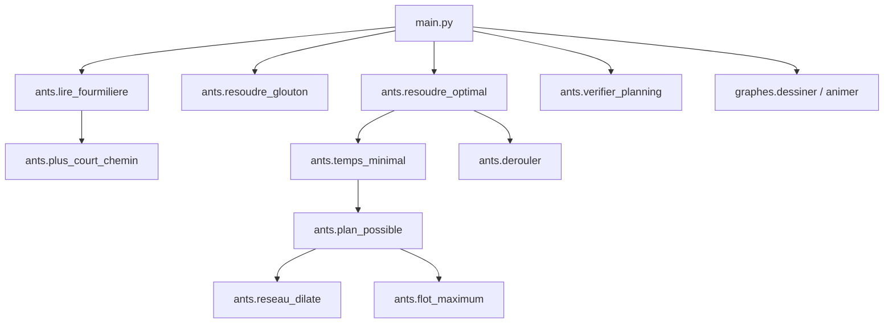

# Comprendre le projet « Une vie de fourmi » — guide complet

> Objectif : pouvoir expliquer **tout** le projet, fonction par fonction et
> question par question. Lis-le une fois en entier, puis utilise le sommaire
> pour réviser.

## Sommaire

1. [Le problème en version simple](#1-le-problème-en-version-simple)
2. [Ce que fait chaque fichier](#2-ce-que-fait-chaque-fichier)
3. [Le format des fichiers et la matrice d'adjacence](#3-le-format-des-fichiers-et-la-matrice-dadjacence)
4. [Le modèle mathématique](#4-le-modèle-mathématique)
5. [Deux méthodes de résolution](#5-deux-méthodes-de-résolution)
6. [`ants.py` : les fonctions dans l'ordre](#6-antspy--les-fonctions-dans-lordre)
7. [`graphes.py` : l'affichage](#7-graphespy--laffichage)
8. [`main.py` : le déroulé du programme](#8-mainpy--le-déroulé-du-programme)
9. [Les commandes](#9-les-commandes)
10. [Les résultats et comment les justifier](#10-les-résultats-et-comment-les-justifier)
11. [Questions de soutenance (et réponses)](#11-questions-de-soutenance-et-réponses)
12. [Petit glossaire](#12-petit-glossaire)

---

## 1. Le problème en version simple

Une fourmilière est un ensemble de **salles** reliées par des **tunnels** :

* `Sv` : le **vestibule** (l'entrée) — toutes les fourmis y sont au départ, et il
  est assez grand pour les accueillir toutes ;
* `Sd` : le **dortoir** (l'arrivée) — assez grand pour toutes les fourmis ;
* `S1`, `S2`, … : les salles ordinaires. Une salle ordinaire contient **1 fourmi**,
  sauf si le fichier précise `Si { k }` : elle peut alors contenir **k fourmis**.

Le temps est découpé en **étapes**. Pendant une étape, chaque fourmi :

* reste dans sa salle (on ne le note pas dans le planning), ou
* traverse **un** tunnel vers une salle voisine (la traversée est instantanée).

Les contraintes :

* une fourmi n'entre dans une salle que si sa capacité n'est pas dépassée à la
  fin de l'étape : salle vide, place libre, ou occupant en train de partir
  (sa place se libère dans la même étape) ;
* une fourmi ne fait qu'**un seul déplacement par étape** ;
* le dortoir est sans limite.

**Ce qu'on doit produire** : le **nombre minimal d'étapes** pour que toute la
colonie soit au dortoir, et le détail de chaque déplacement :

```
+++ E1 +++
f1 - Sv - S1
f2 - Sv - S2
+++ E2 +++
...
```

| Règle de l'énoncé | Ce que ça devient dans le code |
|---|---|
| Salles reliées par des tunnels | graphe : salles = sommets, tunnels = arêtes |
| « 1 fourmi par salle », sauf `Si { k }` | une **capacité** par salle |
| Traversée instantanée | un tunnel = une étape, sans limite de débit sur le tunnel |
| Une fourmi = un déplacement par étape | au plus un tunnel franchi par fourmi et par étape |
| Attendre | la fourmi reste sur place |
| « Minimum d'étapes » | on cherche le plus petit `T` réalisable |

---

## 2. Ce que fait chaque fichier

| Fichier | Rôle | Contenu |
|---|---|---|
| **`ants.py`** | **le cerveau** | lecture, matrice d'adjacence, parcours en largeur, **glouton**, **méthode exacte (flot)**, vérification, format |
| **`graphes.py`** | **les yeux** | dessin du graphe, animation, images PNG |
| **`main.py`** | **le chef d'orchestre** | enchaîne les 5 étapes et affiche les deux résultats |
| `requirements.txt` | bibliothèques à installer | `networkx`, `matplotlib` |
| `fourmilieres/` | **données d'entrée** (fournies) | 9 fichiers décrivant les fourmilières |
| `solutions/` | **résultats** | un planning **optimal** par fourmilière |
| `images/` | captures pour le rapport | une image PNG par étape |
| `README.md` | fiche de présentation | contexte, méthode, résultats |
| `EXPLICATIONS.md` | ce guide | explications détaillées |
| `exercice1609.py` | ton brouillon personnel (BFS/networkx) | laissé intact |

Chaîne d'appels :



---

## 3. Le format des fichiers et la matrice d'adjacence

Exemple avec `fourmilieres/fourmiliere_un.txt` :

```
f=5
S1
S2
Sv - S1
S1 - S2
S2 - Sd
```

Lecture ligne par ligne :

* `f=5` (ou `F=5`) → **5 fourmis** ;
* `S1` → une salle de **capacité 1** (valeur par défaut) ;
* `S2 { 3 }` → une salle de **capacité 3** ;
* `Sv - S1` → un **tunnel** entre deux salles.

Le programme range les salles dans une liste (`"salles"`) : leur **indice** sert
de numéro de salle. Les tunnels remplissent alors la **matrice d'adjacence** :

```
salles   = ["Sv", "S1", "S2", "Sd"]
capacités = [ 5,    1,    1,    5 ]     # Sv et Sd accueillent toute la colonie

matrice =  Sv  S1  S2  Sd
    Sv  [  0,  1,  0,  0 ]      matrice[i][j] = 1  ⇔  tunnel entre i et j
    S1  [  1,  0,  1,  0 ]
    S2  [  0,  1,  0,  1 ]
    Sd  [  0,  0,  1,  0 ]
```

Les voisins d'une salle `i` sont donc simplement les `j` tels que
`matrice[i][j] == 1` (fonction `voisins`). C'est exactement la représentation
vue en cours.

⚠️ **Piège repéré dans les fichiers fournis** : les noms ne correspondent pas
toujours au contenu.

| Fichier | Contenu réel |
|---|---|
| `fourmiliere_zero.txt` | 2 fourmis, 2 chemins de longueur 2 |
| `fourmiliere_deux.txt` | 5 fourmis + un **tunnel direct** `Sd - Sv` (1 étape !) |
| `La_hormiguera_de_la_muerte.txt` | **f=30**, salles `S1`…`S10` très connectées (46 tunnels) |
| `salle_d_at-ant.txt` | **F=100**, salles `S1`…`S21`, 4 chaînes + le carrefour `S21` |

---

## 4. Le modèle mathématique

1. **La fourmilière est un graphe** (matrice d'adjacence) avec une **capacité**
   par sommet.
2. **La distance** d'une salle au dortoir (en tunnels) se calcule par un
   **parcours en largeur** (BFS) : c'est le temps minimal d'une fourmi seule.
   Elle donne une **borne inférieure** : aucune solution ne peut faire mieux.
3. **Les fourmis se gênent** : une salle pleine bloque l'entrée. Il faut donc
   décider les déplacements de tout le monde **en même temps**, étape par étape.

---

## 5. Deux méthodes de résolution

### 5.1 Le glouton (méthode simple, vue en cours)

Principe : à chaque étape,

1. on compte les fourmis présentes dans chaque salle ;
2. on examine les fourmis en commençant par celles qui sont **le plus près du
   dortoir** (elles libèrent la place pour les suivantes) ;
3. chacune avance vers une salle voisine **plus proche du dortoir** s'il reste
   une place à la fin de l'étape, sinon elle attend ;
4. tous les mouvements sont appliqués **en même temps**.

Avantages : très simple, très rapide, et **optimal** sur les fourmilières
« en tuyau » (une seule voie, ou plusieurs voies parallèles de même longueur).

Limite : le glouton ne regarde que **la distance**, jamais **le débit** des
voies. Quand un chemin court mais étroit concurrence un chemin plus long mais
large, il s'engouffre dans le chemin court et se bloque. C'est exactement ce
qui arrive dans `salle_d_at-ant` :

* le chemin le plus court est `Sv-S1-S2-S3-S4-S5-Sd` mais `S4` et `S5` n'ont
  qu'**une** place : 1 fourmi par étape !
* le carrefour `S21` permet de rejoindre les chaînes larges (`S18-S19-S20-Sd`
  avec 5 places), mais il est **plus loin** du dortoir que `S4` : le glouton
  refuse donc d'y aller (ce serait « reculer » en distance).
* Résultat : **98 étapes** au lieu de **15**.

### 5.2 L'idée de la méthode exacte : le réseau dilaté dans le temps

On recopie la fourmilière **à chaque pas de temps** (`t = 0, 1, 2, …`) :

* `(ENTREE, salle, t)` : « on peut arriver dans cette salle au pas t » ;
* `(SORTIE, salle, t)` : « on peut quitter cette salle au pas t ».

| Arc | Signification | Capacité |
|---|---|---|
| `(ENTREE, s, t) → (SORTIE, s, t)` | occuper une place dans la salle `s` au pas `t` | **capacité de la salle** |
| `(SORTIE, s, t) → (ENTREE, s, t+1)` | **attendre** un pas de plus | capacité de la salle |
| `(SORTIE, u, t) → (ENTREE, v, t+1)` | **traverser** le tunnel `u - v` | capacité de `v` |
| `SOURCE → (ENTREE, Sv, 0)` | le départ des F fourmis | F |
| `(SORTIE, Sd, t) → PUITS` | être arrivé au dortoir | F |

Deux arcs inutiles sont volontairement absents : sortir du dortoir et rentrer
dans le vestibule.

**Pourquoi ça marche ?** Un plan de T étapes donne un chemin dans ce réseau pour
chaque fourmi, donc un **flot** de valeur F. Réciproquement, un flot entier de
valeur F se découpe en F chemins `SOURCE → PUITS`, et chaque chemin décrit la
position d'une fourmi à chaque pas : c'est un plan valide. Donc :

> « un plan en au plus T étapes existe » ⟺ « le flot maximum vaut F ».

### 5.3 Le flot maximum : Edmonds-Karp (écrit à la main)

1. on part d'un flot vide ;
2. on cherche un **chemin augmentant** : un chemin `SOURCE → PUITS` dont tous
   les arcs ont encore de la place (parcours en largeur) ;
3. on y fait passer le **goulot d'étranglement** (la plus petite capacité
   restante du chemin) ;
4. on met à jour les capacités restantes, et on autorise l'**arc inverse** pour
   pouvoir annuler un mauvais choix ;
5. on recommence jusqu'à ce qu'aucun chemin n'existe.

Fonction `flot_maximum` dans `ants.py`. `limite=F` permet de s'arrêter dès que
les F fourmis sont passées (question « est-ce possible en T étapes ? »).

### 5.4 La dichotomie : trouver le plus petit T

`plan_possible(T)` est **monotone** (possible en T ⇒ possible en T+1) :

* borne basse : la distance `Sv → Sd` (BFS) ;
* borne haute : `distance + F` (toujours possible en file indienne).

On coupe l'intervalle en deux à chaque essai : ~7 calculs de flot suffisent
pour F = 100 (`temps_minimal`).

### 5.5 Du flot au planning

Chaque arc de traversée qui transporte `k` unités signifie « `k` fourmis
empruntent ce tunnel à ce pas ». `derouler` répartit ces mouvements entre les
fourmis présentes dans la salle : elles sont interchangeables, on choisit donc
lesquelles partent, les autres attendent.

---

## 6. `ants.py` : les fonctions dans l'ordre

| # | Fonction | Entrée | Sortie | Idée |
|---|---|---|---|---|
| 1 | `lire_fourmiliere` | chemin du fichier | dictionnaire fourmilière | lit `f=`, les salles, capacités, tunnels et remplit la matrice |
| 2 | `exemple_du_sujet` | — | dictionnaire | le « cas simple » de l'énoncé (3 fourmis) |
| 3 | `indice` | fourmilière, nom | numéro de salle | conversion nom → indice |
| 4 | `voisins` | fourmilière, salle | liste d'indices | une ligne de la matrice |
| 5 | `distances` | fourmilière, départ | liste de distances | BFS sur la matrice (-1 si injoignable) |
| 6 | `plus_court_chemin` | fourmilière, départ, arrivée | liste de salles | BFS avec prédécesseurs |
| 7 | `construire_graphe` | fourmilière | graphe networkx | pour l'affichage |
| 8 | `place_libre` | … | entier | places libres **à la fin de l'étape** (les partants libèrent leur place) |
| 9 | `choisir_destination` | … | salle ou `None` | meilleure salle voisine plus proche du dortoir |
| 10 | `resoudre_glouton` | fourmilière | `{"duree", "etapes", "etats"}` | **l'algorithme glouton** |
| 11 | `occupation` | fourmilière, positions | `{salle: [fourmis]}` | pour l'affichage |
| 12 | `reseau_dilate` | fourmilière, T | dictionnaire de capacités | le réseau dilaté dans le temps |
| 13 | `chemin_augmentant` | capacités restantes, source, puits | chemin ou `None` | BFS : un chemin avec encore de la place |
| 14 | `flot_maximum` | capacités, source, puits | `(valeur, flot)` | **Edmonds-Karp** |
| 15 | `plan_possible` | fourmilière, T | booléen | le flot maximum vaut-il F ? |
| 16 | `temps_minimal` | fourmilière | entier | dichotomie → minimum d'étapes |
| 17 | `resoudre_optimal` | fourmilière | `{"duree", "etapes", "etats"}` | flot maximum + déroulé → planning optimal |
| 18 | `derouler` | fourmilière, T, passages | étapes + états | transforme le flot en mouvements de fourmis |
| 19 | `verifier_planning` | fourmilière, étapes | nombre d'étapes | rejoue le planning et vérifie chaque règle |
| 20 | `format_planning` | fourmilière, étapes | texte | format `+++ E1 +++` / `f1 - Sv - S1` |
| 21 | `lire_planning` | fourmilière, texte | étapes | relit un planning enregistré |

Représentation d'une fourmilière (dictionnaire, pas de classe) :

```python
{
    "nom": "fourmiliere_un",
    "fourmis": 5,
    "salles": ["Sv", "S1", "S2", "Sd"],
    "capacites": [5, 1, 1, 5],
    "matrice": [[0, 1, 0, 0], [1, 0, 1, 0], [0, 1, 0, 1], [0, 0, 1, 0]],
}
```

Un **mouvement** est un triplet `(numéro de fourmi, salle de départ, salle
d'arrivée)` où les salles sont des numéros ; `format_planning` les traduit en
noms pour l'affichage.

---

## 7. `graphes.py` : l'affichage

| Fonction | Ce qu'elle fait |
|---|---|
| `positions_par_niveaux` | colonnes selon la distance au vestibule (`Sv` à gauche, `Sd` à droite), tri « humain » (`S2` avant `S10`) |
| `etiquette_salle` | nom + capacité |
| `couleur_salle` | bleu = vide, jaune clair = occupée, jaune = pleine, vert = vestibule, rouge = dortoir |
| `texte_fourmis` | `f1 f2 f3 …` sous la salle (au-delà de 5 : `+k`) |
| `dessiner` | dessine le graphe avec les fourmis, renvoie/enregistre la figure |
| `animer` | fenêtre : déroulement étape par étape |
| `enregistrer_images` | un PNG par étape dans `images/<fourmilière>/` |

matplotlib n'est chargé que si on demande `--graphes` ou `--images`.

---

## 8. `main.py` : le déroulé du programme

```
Étape 1 - lecture : 10 fourmis, 8 salles, 9 tunnels
Étape 2 - graphe : plus court chemin Sv -> S1 -> S2 -> S4 -> S5 -> Sd (5 tunnels)
Étape 3 - glouton : dortoir atteint en 9 étapes (planning valide)
Étape 4 - flot maximum : minimum de 9 étapes (le glouton est optimal ici)
Étape 5 - planning optimal écrit dans solutions/fourmiliere_quatre.txt
```

Les deux méthodes sont toujours calculées et comparées : c'est la démarche du
projet (« on commence simple, on mesure, puis on passe à une méthode exacte »).

---

## 9. Les commandes

```bash
python main.py                        # les 9 fourmilières + récapitulatif
python main.py fourmiliere_un         # une seule fourmilière
python main.py fourmiliere_un -d      # détail du planning optimal
python main.py fourmiliere_un -i      # images dans images/
python main.py fourmiliere_un -g      # graphe + animation
python main.py --verifier             # rejoue les plannings enregistrés
python main.py --test                 # cas simple de l'énoncé (les 2 méthodes)
python main.py --help                 # usage
```

| Option | Effet |
|---|---|
| `-d` / `--details` | affiche le planning optimal complet |
| `-i` / `--images` | écrit un PNG par étape |
| `-g` / `--graphes` | fenêtre + animation |
| `-v` / `--verifier` | relit `solutions/` et vérifie (valide + optimal) |
| `-t` / `--test` | cas simple de l'énoncé |

---

## 10. Les résultats et comment les justifier

| fourmilière | fourmis | trajet | glouton | **minimum** |
|---|---|---|---|---|
| `fourmiliere_zero` | 2 | 2 | 2 | **2** |
| `fourmiliere_un` | 5 | 3 | 7 | **7** |
| `fourmiliere_deux` | 5 | 1 | 1 | **1** |
| `fourmiliere_trois` | 5 | 3 | 7 | **7** |
| `fourmiliere_quatre` | 10 | 5 | 9 | **9** |
| `fourmiliere_cinq` | 50 | 5 | 17 | **11** |
| `fourmiliere_3D` | 50 | 4 | 28 | **14** |
| `La_hormiguera_de_la_muerte` | 30 | 4 | 9 | **9** |
| `salle_d_at-ant` | 100 | 6 | 98 | **15** |

Enseignements :

* le glouton est **optimal sur 7 fourmilières sur 9** (les petites et les
  fourmilières sans goulet) ;
* il échoue sur celles où un **chemin court mais étroit** attire les fourmis :
  `fourmiliere_cinq` (17 vs 11), `fourmiliere_3D` (28 vs 14),
  `salle_d_at-ant` (98 vs 15) ;
* la méthode exacte donne **toujours** le minimum, comme le prouve le flot.

### Comment prouver un minimum à la main (exemple)

`fourmiliere_un` (`Sv - S1 - S2 - Sd`, 5 fourmis, capacité 1 partout) :

* **T ≥ 7** : `S1` n'a qu'une place, donc au plus une fourmi franchit
  `Sv → S1` par étape ; la 5ᵉ fourmi ne peut passer qu'à l'étape 5. Il lui reste
  `S1 → S2` (1 étape) puis `S2 → Sd` (1 étape) → arrivée à l'étape **7** ;
* **T ≤ 7** : le programme fournit un plan en 7 étapes (file indienne) ;
* donc **T = 7**. Formule générale d'une chaîne : `distance + F - 1`.

### Pourquoi le minimum ne peut pas être « battu »

Le flot n'est pas une heuristique : si un plan en T étapes existait, le réseau
dilaté de durée T aurait un flot de valeur F, et le test de dichotomie l'aurait
détecté. `python main.py --verifier` rejoue en plus chaque planning enregistré
et confirme qu'il est valide **et** optimal.

---

## 11. Questions de soutenance (et réponses)

**1. Pourquoi une matrice d'adjacence ?**
Parce que le fichier ne donne que des tunnels : la matrice `matrice[i][j] = 1`
dit qui touche qui, les voisins d'une salle sont sa ligne, et le BFS s'écrit en
quelques lignes. (Pour l'affichage, on la convertit en graphe networkx.)

**2. Pourquoi un glouton ?**
C'est la première idée naturelle : avancer vers le dortoir dès qu'une place est
libre. Il est simple, rapide, et donne le bon résultat sur la plupart des
fourmilières.

**3. Pourquoi le glouton n'est-il pas toujours optimal ?**
Il ne compare que les **distances**, jamais les **débits**. Il s'engouffre dans
le chemin le plus court même si celui-ci est un goulet (1 place), alors qu'un
détour plus long mais plus large ferait passer beaucoup plus de fourmis. C'est
ce qui se passe dans `salle_d_at-ant` : 98 étapes au lieu de 15.

**4. Comment as-tu obtenu le minimum alors ?**
En transformant le problème en **flot** : on recopie la fourmilière à chaque pas
de temps (réseau dilaté), chaque fourmi est une unité de flot, et un flot de F
unités de `Sv` (temps 0) à `Sd` **est** un plan valide. Le plus petit T pour
lequel ce flot existe est le minimum, et on le trouve par dichotomie.

**5. Comment le flot est-il calculé ?**
Par l'algorithme d'Edmonds-Karp écrit à la main : chemin augmentant (BFS),
goulot d'étranglement, capacités restantes, arcs inverses. Aucune fonction de
flot toute faite de `networkx` n'est utilisée.

**6. Que change une salle de capacité 2 ?**
Elle devient un arc de capacité 2 dans le réseau : deux fourmis peuvent s'y
trouver au même pas, et si elles partent, deux autres peuvent entrer au pas
suivant. C'est ce qui permet à `fourmiliere_cinq` de finir en 11 étapes.

**7. Deux fourmis peuvent-elles traverser le même tunnel la même étape ?**
Oui : les tunnels sont des **portes** instantanées, la seule limite est la place
dans la salle d'arrivée (c'est la capacité de l'arc de traversée).

**8. Peut-on attendre, et où ?**
Oui, dans n'importe quelle salle : c'est l'arc « attendre » du réseau, de
capacité égale à la capacité de la salle (attendre occupe une place).

**9. Comment passes-tu du flot au planning ?**
Chaque arc de traversée qui transporte k unités dit que k fourmis empruntent ce
tunnel à ce pas ; `derouler` répartit ces mouvements entre les fourmis
présentes (elles sont interchangeables).

**10. Comment vérifies-tu les plannings livrés ?**
`verifier_planning` rejoue le planning : numérotation des fourmis, un seul
déplacement par étape, tunnel existant dans la matrice, capacités après chaque
étape, arrivée au dortoir. `python main.py --verifier` le fait sur les fichiers
de `solutions/` et compare la durée au minimum calculé.

**11. Pourquoi `networkx` et `matplotlib` alors ?**
`networkx` sert uniquement à **dessiner** le graphe (et à sa conversion pour
l'affichage) ; `matplotlib` fait le rendu. Toute la partie algorithmique
(BFS, glouton, réseau dilaté, flot) est écrite à la main dans `ants.py`.

**12. Combien de temps ça calcule ?**
Le réseau dilaté a environ `2 × salles × (T+1)` nœuds (≈ 1 000 au maximum) et
Edmonds-Karp fait peu d'augmentations : les 9 fourmilières se résolvent en
environ une seconde au total.

**13. Que se passe-t-il si le dortoir est inaccessible ?**
`plus_court_chemin` lève `ErreurFourmiliere`, `main.py` l'attrape et affiche
« échec : … » sans planter.

**14. Pourquoi les fourmis sont-elles numérotées dans cet ordre ?**
Elles sont interchangeables ; on attribue les numéros en partant du vestibule,
ce qui donne `f1` première, `f2` ensuite, etc. — la présentation la plus lisible.

---

## 12. Petit glossaire

| Mot | Définition |
|---|---|
| **Sommet / arête** | une salle / un tunnel |
| **Matrice d'adjacence** | tableau où `matrice[i][j] = 1` s'il y a un tunnel entre les salles i et j |
| **Capacité d'une salle** | nombre de fourmis qu'elle peut contenir (1 par défaut) |
| **Parcours en largeur (BFS)** | exploration niveau par niveau : donne les distances |
| **File** | structure « premier entré, premier sorti » (`deque`) utilisée par le BFS |
| **Algorithme glouton** | à chaque étape, on fait le choix qui semble le meilleur sur le moment (ici : avancer vers le dortoir) — rapide, mais pas toujours optimal |
| **Goulet** | salle à faible capacité qui limite le débit de tout un chemin |
| **Flot** | façon de faire circuler des unités (ici des fourmis) d'une source vers un puits en respectant des capacités |
| **Réseau dilaté dans le temps** | copie du graphe à chaque pas de temps, avec « attendre » et « traverser » |
| **Edmonds-Karp** | algorithme de flot maximum : pousser du flot le long de chemins augmentants trouvés par BFS |
| **Chemin augmentant** | chemin de la source au puits dont tous les arcs ont encore de la capacité |
| **Goulot d'étranglement** | plus petite capacité restante le long d'un chemin ; c'est ce qu'on y fait passer |
| **Arc arrière (inverse)** | arc virtuel qui permet d'annuler du flot déjà envoyé |
| **Monotone** | si c'est possible en T, c'est possible en T+1 (indispensable pour la dichotomie) |
| **Dichotomie** | couper l'intervalle de recherche en deux à chaque essai |
| **Pipeline** | les fourmis avancent en file indienne, une par étape et par salle |
| **Validateur** | programme qui rejoue le planning et vérifie chaque règle |

---

### Pour réviser en 5 minutes

1. **Les données** : fichier → liste des salles + capacités + **matrice d'adjacence**.
2. **Les distances** : un BFS donne le trajet minimal `Sv → Sd` (borne basse).
3. **Le glouton** : avancer vers le dortoir si la place est libre — simple, mais
   aveugle aux goulets (17/28/98 étapes sur trois fourmilières).
4. **La méthode exacte** : réseau dilaté dans le temps + **flot maximum**
   (Edmonds-Karp) + dichotomie → le vrai minimum (11/14/15).
5. **La preuve** : `python main.py --verifier` rejoue les plannings et confirme
   qu'ils sont valides et optimaux.
